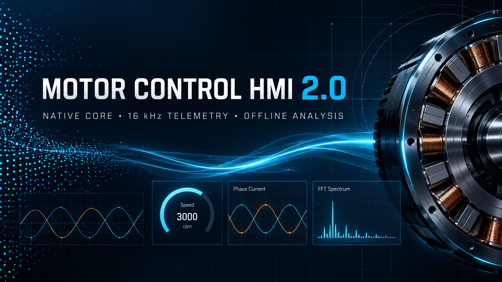
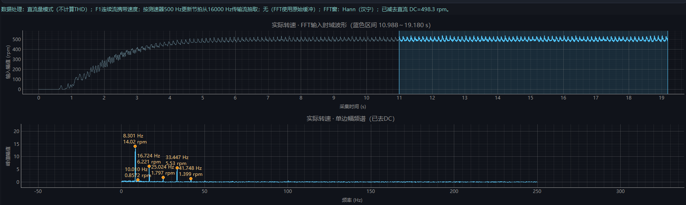
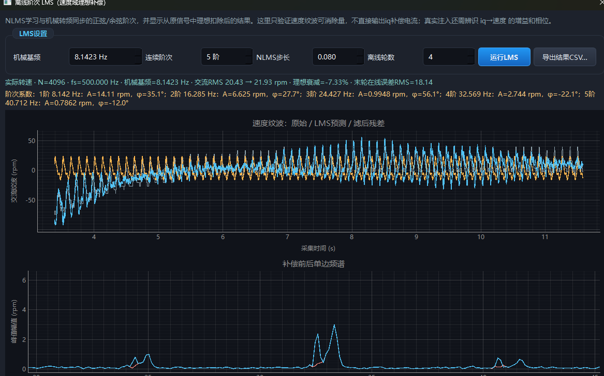
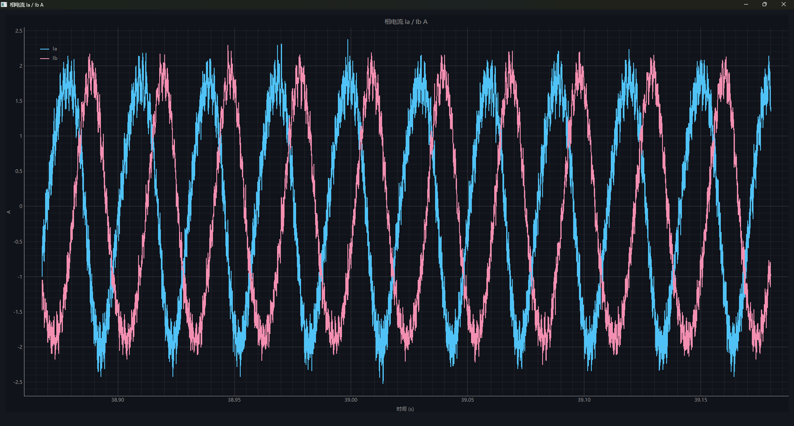

# Motor Control HMI v2.0.0

v2.0.0 是上位机从“功能堆叠”转向“高速数据基础设施 + 可验证分析工具”的阶段版本。
核心目标是让 16 kHz 电流数据能够稳定进入主机、批量处理和保存，同时让速度、频谱与参数辨识使用正确的数据时间基准。

## 重点更新

### C++ 原生高速数据通路

- C++ 原生帧解析、遥测缩放和列式批处理替代逐样本 Python 字典热路径。
- 原生模块 schema 升级，运行时可用 `python main.py --runtime-check` 核对 Python、扩展模块路径和数据 schema。
- F1/40 连续遥测覆盖 Id/Iq、参考值、Ia/Ib、执行角、Vd/Vq、PWM 比较值、Vbus/VDDA、转速和连续序号。
- 标准 TCP 模式可承载 16 kHz FOC 周期数据；旧 F1/32/30 仍保留兼容读取。
- 控制、ACK、心跳和高速遥测分离调度，避免大批量波形挤占安全控制消息。

### 正确的速度与频谱时间基准

- 16 kHz F1 中的重复转速按测速器 **500 Hz** 更新节拍抽取，不再把重复点误认为独立速度采样。
- 转速趋势、CSV 与离线 FFT 共用同一条 500 Hz 数据链。
- FFT 页面同时显示完整输入时域波形与实际分析区间。
- 蓝色分析区间可直接拖动左右边界，松开后自动重新计算样本数、时间长度、分辨率和频谱。
- 支持直流量纹波分析、DC保留/移除、Hann/Blackman/矩形窗、峰值标注和带注释图片保存。

### 主机侧辨识与实验分析

- 固件实时电流环不再运行 RLS/ESO 矩阵；F1 提供原始采样和实际执行量，由主机 C++/Python 分析链离线重放。
- 新格式 CSV 保存直接 dq 电流、参考值、PWM最终比较值、执行角、母线电压和采样基准。
- 主机侧真机匹配 ESO、三阶 ARX/RLS 重放与闭环 IV 物理参数验证相互分离，避免把数值稳定误报成物理收敛。
- 离线机械阶次 NLMS 可学习指定阶次的正余弦幅相、显示原始/预测/残差和补偿前后频谱，并允许独立隐藏每条曲线。
- 阶次 NLMS 当前定位为**实验性速度域分析**，不直接生成真机 q 轴补偿电流；真实注入仍需辨识 `iq → speed` 幅相通道。

### 绘图、过滤与可用性

- 高频波形使用批量追加和固定容量原始缓冲；显示滤波不再改写 CSV 与 FFT 数据。
- 遥测滤波、速度 FIFO、矢量可视化和功率流保持显式开关，默认降低非必要刷新负担。
- 缺少 PyTorch 的精简环境会自动隐藏训练页，其余监控、控制和辨识页面仍可启动。
- 通信页补充 F0～F4 数据职责、采样率和兼容路径说明。

## 数据通道摘要

| 通道 | 用途 | 典型速率 |
| --- | --- | --- |
| F0 | 状态、故障、慢变量与控制回读 | 约 10 Hz |
| F1 | 连续高速电流、电压、角度、PWM、转速 | TCP最高 16 kHz |
| F2 | ADC/PWM采样诊断 | 约 50 Hz |
| F3 | 旧固件RLS兼容帧；新链路由主机辨识 | 兼容保留 |
| F4 | 触发式2048点电流/角度快照 | 16 kHz批量返回 |

## 升级说明

1. 建议重新构建并安装 `native_core`，保证 `motor_core_cpp` 的 telemetry schema 与当前源码一致。
2. 启动前可执行 `python main.py --runtime-check` 检查实际加载的 Python 和 C++ 扩展路径。
3. 旧 F1/32/30 与旧 CSV 可以读取，但缺少最终 PWM、执行角或实测母线信息时，物理参数辨识会明确降级为诊断模式。
4. 16 kHz 连续遥测建议使用 TCP；串口兼容模式继续保留较低速率。

## 验证

- Python/Qt/通信/FFT/辨识相关自动化测试通过。
- 500 Hz速度抽取、FFT区间拖选、CSV时间基准和LMS曲线开关均有回归测试。
- C++扩展运行时 schema 检查和旧协议兼容路径保留。

## 已知边界

- 离线阶次 LMS 的固定系数回放不等于真机主动转矩补偿；非平稳区间可能出现负衰减。
- 机械阶次的可重复相位应改用编码器机械角度作为基函数，当前固定时间基准只适合稳态实验。
- PWM重构电压不是端子电压传感器测量，尚未覆盖全部死区、器件压降和瞬时母线纹波。
